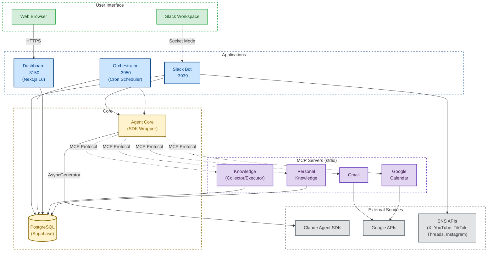

# Argus

[](https://github.com/ryusuke-ai/argus)
[](https://github.com/ryusuke-ai/argus)
[](https://github.com/ryusuke-ai/argus)
[](https://docs.anthropic.com/en/docs/agents-and-tools/claude-code/sdk)
[](LICENSE)

> AI-powered multi-agent orchestration system that autonomously manages tasks, generates content, and integrates with external services — all controlled through Slack.

<p align="center">
  
</p>

## Overview

Argus is a production-ready AI agent platform built as a TypeScript monorepo. It wraps the [Claude Agent SDK](https://docs.anthropic.com/en/docs/agents-and-tools/claude-code/sdk) with a hook-based observation layer, enabling real-time monitoring and episodic memory across all agent executions. The system runs 24/7 on Railway VPS, processing Slack messages, managing emails, scheduling tasks, and generating multi-platform social media content — with every tool invocation recorded for full traceability.

## Architecture



The system consists of three application layers:

- **Slack Bot** — Primary user interface. Routes messages to specialized handlers (inbox tasks, SNS content, deep research), manages Claude sessions per Slack thread, and provides Block Kit interactive UI.
- **Agent Orchestrator** — Automated backend. Runs scheduled agents via cron (Gmail checking, daily planning, code quality patrol), exposes REST API for knowledge management.
- **Dashboard** — Next.js 16 monitoring UI. Displays sessions, messages, tool execution logs, agent history, and serves generated media files.

All three applications share a common execution engine (`@argus/agent-core`) that wraps the Claude Agent SDK with hook-based observation, and a unified data layer (`@argus/db`) backed by PostgreSQL via Drizzle ORM.

## Key Features

- **Session-per-Thread Model** — Each Slack thread maps to one Claude session with automatic resume. Conversations persist across restarts.
- **Observation-First Architecture** — Every tool invocation is recorded via hooks (PreToolUse/PostToolUse). Full execution history is reconstructable from the database.
- **Episodic Memory** — Agent errors and resolutions are stored in a `lessons` table and injected into future prompts, enabling the system to learn from past mistakes.
- **MCP-Based Tool Integration** — Knowledge bases, Gmail, and Google Calendar are exposed as [Model Context Protocol](https://modelcontextprotocol.io/) servers with role-based access control (Collector/Executor separation).
- **Deep Research** — Triggered by natural language ("調べて", "deep research"). Performs multi-source web research with real-time progress notifications and structured Block Kit reports.
- **Multi-Platform SNS Pipeline** — Automated content generation for 10 platforms (X, YouTube, TikTok, Qiita, Zenn, note, Threads, Instagram, GitHub, Podcast) with a 3-phase workflow: propose → approve → publish.
- **Inbox Agent** — Autonomous task execution from `#argus-inbox`. Classifies messages by intent, queues tasks with autonomy levels, and executes with failure detection and crash recovery.
- **Dual-Mode Execution** — Automatically detects Claude Max Plan (local, free) vs API key (server, paid) and switches seamlessly. Local development uses Claude Desktop; production uses the Anthropic API.
- **Daily Planning** — Automated morning briefing that aggregates calendar events, pending tasks, inbox items, and Gmail into a structured Slack report.
- **Interactive Approval Flows** — Email drafts, SNS posts, and calendar events use Slack Block Kit cards with approve/edit/cancel buttons for human-in-the-loop control.

## Tech Stack

| Layer      | Technology                                                       | Purpose                                              |
| ---------- | ---------------------------------------------------------------- | ---------------------------------------------------- |
| Runtime    | Node.js >= 22.12.0, pnpm 10.x                                    | JavaScript runtime and package management            |
| Language   | TypeScript 5.x (strict, ESM)                                     | Type-safe development with ES modules                |
| AI         | Claude Agent SDK (`@anthropic-ai/claude-agent-sdk`)              | Agent execution with tool use and session management |
| Frontend   | Next.js 16, React 19, Tailwind CSS 4                             | Dashboard web application                            |
| Database   | PostgreSQL (Supabase), Drizzle ORM                               | Persistent storage with type-safe queries            |
| Messaging  | Slack Bolt, Socket Mode                                          | Real-time Slack integration                          |
| Protocols  | Model Context Protocol (MCP)                                     | Standardized tool integration for AI agents          |
| APIs       | Google APIs (Gmail, Calendar), Meta (Threads, Instagram), TikTok | External service integration                         |
| Storage    | Cloudflare R2 (S3-compatible)                                    | Media asset storage                                  |
| Testing    | Vitest 4, Testing Library                                        | Unit and integration testing                         |
| Deployment | Railway VPS, Docker, PM2                                         | Container-based production hosting                   |
| Security   | Cloudflare Tunnel + Access                                       | HTTPS tunneling with email-based authentication      |

## Project Structure

```
argus/
├── apps/
│   ├── slack-bot/              # Slack integration (Socket Mode)
│   ├── dashboard/              # Next.js 16 monitoring UI
│   └── agent-orchestrator/     # Cron scheduler + REST API
├── packages/
│   ├── agent-core/             # Claude SDK wrapper (query/resume/hooks)
│   ├── db/                     # Drizzle ORM schema (15+ tables)
│   ├── knowledge/              # Knowledge MCP server
│   ├── knowledge-personal/     # Personal knowledge MCP server
│   ├── gmail/                  # Google API (OAuth2 + Gmail MCP)
│   ├── google-calendar/        # Google Calendar MCP server
│   ├── tiktok/                 # TikTok Content Posting API
│   └── r2-storage/             # Cloudflare R2 client
├── docs/
│   ├── adr/                    # Architecture Decision Records
│   └── diagrams/               # Mermaid architecture diagrams
└── .claude/                    # Agent rules, skills, and permissions
```

| Package                     | Description                                                                                         |
| --------------------------- | --------------------------------------------------------------------------------------------------- |
| `@argus/agent-core`         | Claude Agent SDK wrapper with hook injection, session management, and Max Plan auto-detection       |
| `@argus/db`                 | Drizzle ORM schema for 15+ tables (sessions, messages, tasks, lessons, knowledge, inbox, SNS posts) |
| `@argus/knowledge`          | MCP server for shared knowledge with Collector/Executor role-based access                           |
| `@argus/knowledge-personal` | MCP server for personal notes, personality data, and habits                                         |
| `@argus/gmail`              | Google OAuth2 token management and Gmail MCP integration                                            |
| `@argus/google-calendar`    | Google Calendar MCP server (reuses Gmail OAuth2 infrastructure)                                     |
| `@argus/tiktok`             | TikTok Content Posting API v2 with OAuth2 and chunked file upload                                   |
| `@argus/r2-storage`         | Cloudflare R2 object storage via S3-compatible API                                                  |

## Quick Start

```bash
# Clone the repository
git clone https://github.com/ryusuke-ai/argus.git
cd argus

# Install dependencies
pnpm install

# Set up environment variables
cp .env.example .env
# Edit .env with your credentials (DATABASE_URL, SLACK_BOT_TOKEN, etc.)

# Push database schema to PostgreSQL
pnpm db:push

# Build all packages
pnpm build

# Run tests
pnpm test

# Start all apps in parallel
pnpm dev
```

| Command                 | Description                               |
| ----------------------- | ----------------------------------------- |
| `pnpm dev`              | Build + start all 3 apps in parallel      |
| `pnpm build`            | Build all packages                        |
| `pnpm test`             | Run all tests (1,165+ across 12 packages) |
| `pnpm dev:slack`        | Start Slack bot only                      |
| `pnpm dev:dashboard`    | Start Dashboard only                      |
| `pnpm dev:orchestrator` | Start Orchestrator only                   |
| `pnpm db:push`          | Push schema changes to database           |
| `pnpm lint`             | Run ESLint                                |

## Design Decisions

Key architectural decisions are documented as ADRs:

| ADR                                                        | Decision                                                                              |
| ---------------------------------------------------------- | ------------------------------------------------------------------------------------- |
| [ADR-001](docs/adr/001-claude-agent-sdk-migration.md)      | Migrated from CLI process spawning to Claude Agent SDK's `query()` AsyncGenerator API |
| [ADR-002](docs/adr/002-mcp-knowledge-architecture.md)      | Knowledge access via MCP servers with Collector/Executor role separation              |
| [ADR-003](docs/adr/003-personal-knowledge-db-migration.md) | Migrated personal knowledge from filesystem to PostgreSQL for security and deployment |
| [ADR-004](docs/adr/004-inbox-agent-autonomy-levels.md)     | Inbox agent with AI-based classification and autonomous execution pipeline            |
| [ADR-005](docs/adr/005-multi-platform-sns-pipeline.md)     | Multi-platform SNS publishing with phased generation and Slack approval workflow      |

## Deployment

Argus runs on **Railway VPS** with a single Docker container managed by PM2:

- **3 PM2 processes**: Slack Bot, Dashboard, Orchestrator
- **External access**: Cloudflare Tunnel for HTTPS
- **Authentication**: Cloudflare Access with email-based one-time PIN
- **Database**: Supabase PostgreSQL (managed)

See [DEPLOYMENT.md](./DEPLOYMENT.md) for the complete deployment guide.

## Testing

```bash
pnpm test
```

The test suite includes **1,165+ tests** across 12 packages, covering:

- Agent core execution and hook injection
- Database service layers with Drizzle ORM mocks
- MCP server tool handlers (knowledge, personal, gmail, calendar)
- Slack message routing and session management
- SNS content pipeline and phased generation
- Dashboard components with Testing Library

## Articles

Technical deep-dives into Argus's architecture and design decisions:

- [Claude Agent SDK でマルチエージェントシステムを作った話 ― CLI spawn からの脱却](https://zenn.dev/ryusuke_ai/articles/claude-agent-sdk-migration)
- [MCP サーバーで AI エージェントにナレッジベースを持たせる方法](https://zenn.dev/ryusuke_ai/articles/mcp-knowledge-base-design)
- [AI エージェントの全行動を記録する ─ Observation-First アーキテクチャの設計と実装](https://zenn.dev/ryusuke_ai/articles/observation-first-architecture)

## License

[MIT](LICENSE)
